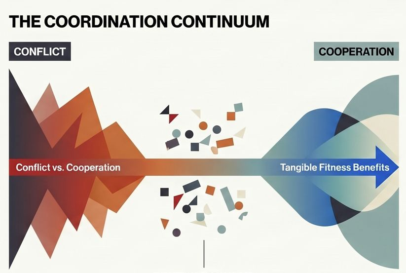
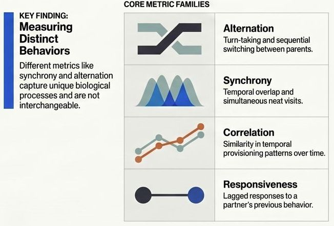
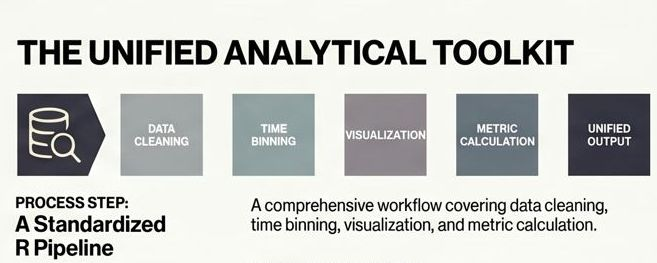

**Simple metrics, complex realities: rethinking parental coordination**

 

::: justify
*Parental coordination* - whether expressed as synchronized nest visits, alternation (turn-taking), or other forms of temporal alignment between parents - has been discussed for more than a decade as a potential mechanism for managing sexual conflict over parental care. Classic theoretical work, e.g. (Johnstone and Hinde 2006) proposed that alternation may function as a negotiation strategy: each parent adjusts its effort in response to the partner’s behavior, thereby preventing exploitation and stabilizing investment. Under this framework, coordination emerges as a behavioral solution to sexual conflict. However, later work, including conceptual contributions by (Griffith 2019), emphasized that coordination may also reflect cooperation rather than conflict. Empirical studies increasingly show that parental coordination is often higher than expected by chance, and that specific coordination patterns are associated with particular ecological or fitness outcomes. Depending on these outcomes and on how they relate to ecological or life-history traits, authors have interpreted coordination either as a mechanism that resolves sexual conflict or as evidence of cooperative investment. In some cases, coordination clearly enhances fitness. For example, synchronized feeding visits reduce nest predation risk, e.g. (Mariette and Griffith 2015; Leniowski and Węgrzyn 2018), suggesting that parents must cooperate to achieve better reproductive success. In other cases, coordination appears to be a form of conditional cooperation: high alternation rates have been linked to improved offspring condition, e.g. (Bebbington and Hatchwell 2016), implying that when alternation is disrupted, chicks suffer. Yet there are also studies in which synchrony or alternation does not differ from random expectations, e.g. (Enns and Williams 2022) or where coordination shows no detectable relationship with reproductive success (Wojczulanis-Jakubas et al. 2018). Taken together, existing findings indicate that parental coordination is not a universal phenomenon with a single function. Instead, it likely lies on a continuum: at one end driven by conflict and negotiation, at the other by cooperation and mutual benefit. Most species probably occupy intermediate positions, with the degree and function of coordination shaped by ecological context, life-history traits and breeding stage. Understanding what parental coordination means biologically is a major question, certainly deserving a separate study.
:::

::: justify
Before interpreting the functionality of parental coordination, it is essential to address a more fundamental issue: how coordination is measured. Clear definitions and consistent methodology are crucial, because different metrics capture different biological processes. For example, alternation indices quantify turn-taking, e.g. (Baldan et al. 2019), whereas synchrony metrics capture temporal overlap (Mariette and Griffith 2012), and correlation-based measures reflect similarity in temporal patterns (Baldan et al. 2019). These metrics are not interchangeable and each highlights a different aspect of parental behavior.
:::

::: justify
The current literature on parental coordination is not extensive but it is methodologically diverse. Each study tends to calculate coordination in its own way, often tailored to the species’ ecology or the structure of the dataset. This flexibility is understandable, different systems have different male–female contributions, provisioning schedules, and constraints. However, the lack of methodological consistency makes it difficult to compare results across studies or to synthesize findings in a meta-analytic framework. Without standardized tools, we cannot reliably assess how environmental conditions, life-history traits or social systems shape coordination.
:::

::: justify
The aim of this project is to develop a comprehensive toolkit (in a form of R package) a set of transparent, well-documented functions for quantifying parental coordination across species and datasets. Each function will clearly state: what aspect of coordination it measures (e.g., alternation, synchrony, correlation, responsiveness), how it should be applied, what assumptions it makes and what biological interpretation it supports.
:::

  

::: justify
The project will also include example datasets and a guided workflow, covering the entire analytical pipeline: data preparation, visualization, calculation of coordination metrics, and reporting of results.
:::

::: justify
The starting point is a review of the existing literature to extract all currently used coordination metrics. Based on this review, we will summarize methodological approaches, identify conceptual overlaps and gaps, and develop a unified set of functions. These functions will be tested on multiple datasets to ensure robustness and to evaluate how different metrics behave under different ecological or behavioral conditions.
:::

::: justify
By providing standardized tools and a clear conceptual framework, this project aims to advance the study of parental coordination, facilitate cross-study comparisons, and ultimately improve our understanding of how parents negotiate, cooperate, and jointly care for their offspring
:::

**Project Plan**   

1. Conceptual and Literature Groundwork - systematic literature review, to identify existing studies that quantify parental coordination, and extract all the methodolgy applied.

2.  Methodological Framework and Toolkit Design - Design and implementation of functions, to develop a standardized toolkit with consistent input/output structure for analysing parental coordination.

3.  Implementation and Testing the functions on Example Datasets - on simulated and real data sets, to compare analysis of metrics on parental coordination

::: {.small-text}
References

Baldan D, Hinde CA, Lessells CM. 2019. Turn-Taking Between Provisioning Parents: Partitioning Alternation. Front Ecol Evol. 7:448. https://doi.org/10.3389/fevo.2019.00448 

Bebbington K, Hatchwell BJ. 2016. Coordinated parental provisioning is related to feeding rate and reproductive success in a songbird. Behav Ecol. 27(2):652–659. https://doi.org/10.1093/beheco/arv198 

Enns J, Williams TD. 2022. Paying attention but not coordinating: parental care in European starlings, Sturnus vulgaris. Anim Behav. 193:113–124. https://doi.org/10.1016/j.anbehav.2022.09.009 

Griffith SC. 2019. Cooperation and Coordination in Socially Monogamous Birds: Moving Away From a Focus on Sexual Conflict. Front Ecol Evol. 7:455. https://doi.org/10.3389/fevo.2019.00455 

Johnstone RA, Hinde CA. 2006. Negotiation over offspring care—how should parents respond to each other’s efforts? Behav Ecol. 17(5):818–827. https://doi.org/10.1093/beheco/arl009 

Leniowski K, Węgrzyn E. 2018. Synchronisation of parental behaviours reduces the risk of nest predation in a socially monogamous passerine bird. Sci Rep. 8(1):7385. https://doi.org/10.1038/s41598-018-25746-5 

Mariette MM, Griffith SC. 2012. Nest visit synchrony is high and correlates with reproductive success in the wild Zebra finch Taeniopygia guttata. J Avian Biol. 43(2):131–140. https://doi.org/10.1111/j.1600-048X.2012.05555.x 

Mariette MM, Griffith SC. 2015. The Adaptive Significance of Provisioning and Foraging Coordination between Breeding Partners. Am Nat. 185(2):270–280. https://doi.org/10.1086/679441 

Wojczulanis-Jakubas K, Araya-Salas M, Jakubas D. 2018. Seabird parents provision their chick in a coordinated manner Descamps S, editor. PLOS ONE. 13(1):e0189969. https://doi.org/10.1371/journal.pone.0189969
:::

-----

  
  

  Project funded by National Science Center:
  <a href="https://projekty.ncn.gov.pl/en/index.php?projekt_id=590682" target="_blank">
    2023/49/B/NZ8/00370
  </a>
  and Fulbright STEM Award (KWJ)

